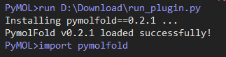
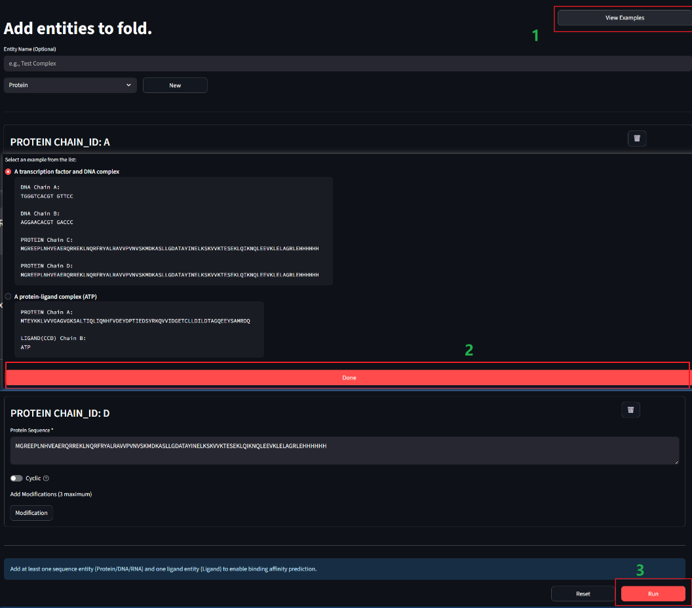
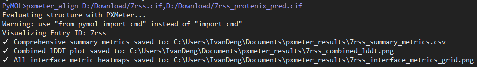

# PymolFold
Inspired by [ColabFold](https://github.com/sokrypton/ColabFold) by [Sergey O](https://github.com/sokrypton).  
Visualization inspired by [pymol-color-alphafold](https://github.com/cbalbin-bio/pymol-color-alphafold).  
Thanks to ESMFold by Meta and the [API](https://esmatlas.com/about#api).  
Fast access to AlphaMissense predicted Human proteins provided by [hegelab](https://alphamissense.hegelab.org/).
## Quick Start Guide

### Step 1: Install PyMOL

PymolFold runs as a plugin within PyMOL. First, ensure you have PyMOL installed. Visit the [official PyMOL website](https://pymol.org/) to download and install the appropriate version for your operating system.

---

### Step 2: Install the Plugin

There are two ways to install PymolFold in PyMOL:

#### Method 1: Using the Plugin Manager(Recommended)

1. Open PyMOL.
2. Navigate to `Plugin -> Plugin Manager`.
3. Select the `Install New Plugin` tab.
4. In the URL field, enter:

    ```
    https://raw.githubusercontent.com/JinyuanSun/PymolFold/refs/heads/main/run_plugin.py
    ```

5. Click `Fetch`. A command prompt window will appear, showing the progress of the installation. 

#### Method 2: Using the `run` Command 

1. Open PyMOL.
2. In the PyMOL command line (starting with `PyMOL>`), copy and paste the following command, then press Enter:

    ```bash
    run https://raw.githubusercontent.com/JinyuanSun/PymolFold/refs/heads/main/run_plugin.py
    ```

3. Wait patiently as PyMOL downloads and installs the PymolFold plugin.

**NOTE**: Both methods will take 4-5 minutes(depending on your internet speed) to complete. After installation, you will see a success message in the PyMOL dialog box.



#### Troubleshooting Installation on Windows

If you encounter the following error during installation:

```
error: Microsoft Visual C++ 14.0 or greater is required. Get it with "Microsoft C++ Build Tools": https://visualstudio.microsoft.com/visual-cpp-build-tools/
```

This error is likely due to an outdated software version on your computer. To resolve this:

1. Visit [Microsoft Visual C++ Build Tools](https://visualstudio.microsoft.com/visual-cpp-build-tools/).
2. Download and install the build tools by running the provided `.exe` file.
3. Refer to [this StackOverflow guide](https://stackoverflow.com/questions/64261546/how-to-solve-error-microsoft-visual-c-14-0-or-greater-is-required-when-inst) for additional help.
4. After installation, retry the plugin installation process.

---

### Step 3: Set API Keys

PymolFold relies on the ESM3 and NVIDIA Boltz-2 APIs. Obtain free API keys from their respective websites:

1. **ESM3 API Key**:
    - Visit [ESM3 API](https://forge.evolutionaryscale.ai).
    - Register and log in to find your API key on the account page.

2. **NVIDIA Boltz-2 API Key**:
    - Visit [NVIDIA Boltz-2 API](https://build.nvidia.com/mit/boltz2?hosted_api=true&integrate_nim=true&modal=integrate-nim).
    - Register and log in to find your API key on the integration page.

3. **NO API KEY is needed for ESMFold** (yeaah!), but 400 residues limit applies(noooo!).
4. **Set API Keys in PyMOL**:

    Use the `set_api_key` command in PyMOL to configure your keys. Replace `your_..._key` with your actual keys:

    ```python
    ## Set ESM3 API Key
    PyMOL> set_api_key ESM_API_TOKEN, your_esm_api_key

    ## Set NVIDIA Boltz-2 API Key
    PyMOL> set_api_key NVCF_API_KEY, your_nvcf_api_key
    ```

    **Verify API Key Setup**:
    ```python
    PyMOL> import os
    PyMOL> print(os.environ.get("ESM_API_TOKEN"))
    PyMOL> print(os.environ.get("NVCF_API_KEY"))
    ```
    If the keys are printed successfully, the setup is complete.

---

## Feature Overview

PymolFold offers powerful features for protein structure prediction and analysis:

### 1. Predict Monomer Structures (`esm3`, `esmfold`, `bfold`)

- **`esm3`**: Predicts monomer structures using the ESMFold engine.
- **`esmfold`**: CLI version of ESMFold for monomer predictions. 
- **`bfold`**: Simplified CLI for Boltz-2, automatically fetching MSA for monomers.

**Usage**:
```python
esm3 sequence [, name]
## Example:
esm3 MKTVRQERLKSIVRILERSKEPVSGAQLAEELSVSRQVIVQDIAYLRSLGYNIVATPRGYVLAGG, my_protein
```

### 2. Folding Web Interface (`foldingui`)

Run `foldingui` to open a web interface in your default browser. This interface supports:

- **ESMFold**: Visual version of the CLI.
- **ESM3**: Visual version of the CLI.
- **Boltz-2**: Advanced version of `bfold`, supporting proteins, DNA, RNA, and small molecules.

**Examples (Boltz-2)**:

You can run the provided example:  


When using CCD code, you can check all the existed CCDs under `pymolfold/gui/ccd_keys.json`.

If you want to predict a head-tail amide bonded cyclic peptide, you may set `cyclic` on.

If you want to use MSA as an auxiliary information, you may set `Add MSA` on. It will automatically query colab design msa search via NVIDIA API.

Calculate affinity when at least one sequence and one small molecule are present.

After clicking **Run** on the web page, wait about 6 seconds (depending on protein size), and the structure will appear in PyMOL!


### 3. Color by pLDDT Scores (`color_plddt`)

Color structures based on pLDDT scores to visualize prediction confidence.

**Usage**:
```python
color_plddt object_name
## Example:
color_plddt my_protein
```


### 4. Evaluate Predictions (`pxmeter_align`)

We utilized [PXMeter](https://github.com/bytedance/PXMeter) to evaluate the differences between predicted structures and reference structures. PXMeter(0.1.4) now only supports PPI analysis, and more details can be seen in their repo. But unfortunately, we copied the repo and refine it since the python version may conflict with the one of PyMOL.

Currently, only `.cif` files are supported for alignment.

**Usage**:
```python
pxmeter_align obj_real_structure_name, obj_pred_structure_name
```

**Note**: The first use may take longer as it downloads a CCD component `.cif` file for non-standard amino acid alignment.

After running the script above, you will get the metrics in `csv` and `png` format under the folder you setted (if not set, it will generate in the root path). You can use the exmaple files under `pymolfold/example/`, and the results should be exactly the same as `pymolfold/example/metrics`.



---

## Related Paper

For more details about the methodology and implementation, please refer to our preprint:

["PymolFold: Integrating Protein Structure Prediction into PyMOL"](https://www.biorxiv.org/content/10.1101/2025.10.03.680230v1) on bioRxiv.

---

## License

This project is licensed under the MIT License. See the [LICENSE](./LICENSE) file for details.
