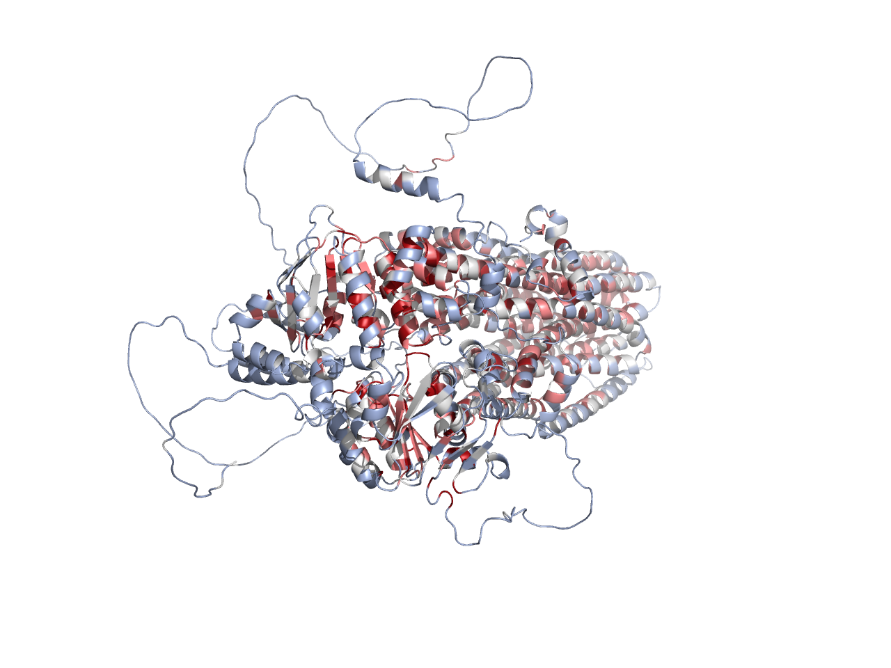

# PymolFold

Fold your protein in PyMOL!  
Inspired by [ColabFold](https://github.com/sokrypton/ColabFold) by [Sergey O](https://github.com/sokrypton).  
Visualization inspired by [pymol-color-alphafold](https://github.com/cbalbin-bio/pymol-color-alphafold).  
Thanks to ESMFold by Meta and the [API](https://esmatlas.com/about#api).  
Fast access to AlphaMissense predicted Human proteins provided by [hegelab](https://alphamissense.hegelab.org/).

**Info**  
The PymolFold service is running on a A5000 instance (cost $100 a week), and the sequence length is limited to 1000aa.

**Issues and Errors**  
If you encounter any errors or issues while using this project, please don't hesitate to open an issue here on GitHub. Your feedback helps us improve the project and make it more user-friendly for everyone.

**PymolFold Server: A Shared Resource**  
Please note that the PymolFold server is a shared resource, and I request you to use it responsibly. Do not abuse the server, as it can affect the availability and performance of the service for other users.

```git
18Jul2024: Add `fetch_af` to fetch AlphaFold predicted proteins in AlphaFold Database using UniProt ID. Deprecate `dms`, `singlemut`, `cpd`, and `webapp`.
10Jan2024: Add `predict_pocket` to predict ligand binding pocket of protein.
03Nov2023: Add `fetch_am` for AlphaMissense predicted Human proteins.
20Sep2023: Add `fold_batch`, a command line tool.
21Aug2023: As the ESMFold API is not stable, the job will be sent to PymolFold server if the job failed.
11Apr2023: `pf_plugin.py` is the PyMOL plugin and the `pf_pkg.py` is a pymol-free python package.
03Dec2022: Add `dms`, `singlemut`, and `webapps`. `pymolfold` allow sequence length up to 700aa.
26Nov2022: ProteinMPNN is now integrated to design proteins.
15Nov2022: I now provide an unofficial API to support user defined recycle number and allow sequence length up to 500aa!
```

## Install pymol-open-source

```bash
conda install -c conda-forge pymol-open-source
```

## Usage

### Load extension into PyMOL. In the PyMOL command prompt

```bash
run https://raw.githubusercontent.com/JinyuanSun/PymolFold/main/pf_plugin.py
# for user still using python2, it is also py3 compatible, only esmfold supports.
run https://raw.githubusercontent.com/JinyuanSun/PymolFold/py27/predict_structure.py
# try the command below in China mainland, the mirror will be delayed if modifications were just made, download the file to your computer and install it is always a good idea:
run https://raw.staticdn.net/JinyuanSun/PymolFold/main/pf_plugin.py
```

Other scripts:

```bash
run https://alphamissense.hegelab.org/coloram.py
```

### Fold your protein  

Also, check META's [web app](https://esmatlas.com/resources?action=fold)

The `color_plddt` command also returns pymol `selection` object of different confidence levels. The color scheme is now compatible with plddt in range (0, 1) and (0, 100) only if they are consistent in your selection.

#### The Meta API (up to 400 aa)  

```bash
esmfold GENGEIPLEIRATTGAEVDTRAVTAVEMTEGTLGIFRLPEEDYTALENFRYNRVAGENWKPASTVIYVGGTYARLCAYAPYNSVEFKNSSLKTEAGLTMQTYAAEKDMRFAVSGGDEVWKKTPTANFELKRAYARLVLSVVRDATYPNTCKITKAKIEAFTGNIITANTVDISTGTEGSGTQTPQYIHTVTTGLKDGFAIGLPQQTFSGGVVLTLTVDGMEYSVTIPANKLSTFVRGTKYIVSLAVKGGKLTLMSDKILIDKDWAEVQTGTGGSGDDYDTSFN, test
color_plddt
orient 
ray 1280, 960, async=1
```

#### The PymolFold API (up to 500 aa, number of recycle can be set in range (3,24))

```bash
pymolfold GENGEIPLEIRATTGAEVDTRAVTAVEMTEGTLGIFRLPEEDYTALENFRYNRVAGENWKPASTVIYVGGTYARLCAYAPYNSVEFKNSSLKTEAGLTMQTYAAEKDMRFAVSGGDEVWKKTPTANFELKRAYARLVLSVVRDATYPNTCKITKAKIEAFTGNIITANTVDISTGTEGSGTQTPQYIHTVTTGLKDGFAIGLPQQTFSGGVVLTLTVDGMEYSVTIPANKLSTFVRGTKYIVSLAVKGGKLTLMSDKILIDKDWAEVQTGTGGSGDDYDTSFN, 4, test
color_plddt
orient 
ray 1280, 960, async=1
```


<!--  -->

### Use `fetch_am` for AlphaMissense predicted Human proteins

```bash
fetch_am cftr_human
coloram 
```


### Use `fetch_af` to fetch AlphaFold predicted proteins in AlphaFold Database using UniProt ID

```bash
fetch_af P26196
```

## Reference
ESMFold:
```bibtex
@article{lin2023evolutionary,
  title={Evolutionary-scale prediction of atomic-level protein structure with a language model},
  author={Lin, Zeming and Akin, Halil and Rao, Roshan and Hie, Brian and Zhu, Zhongkai and Lu, Wenting and Smetanin, Nikita and Verkuil, Robert and Kabeli, Ori and Shmueli, Yaniv and others},
  journal={Science},
  volume={379},
  number={6637},
  pages={1123--1130},
  year={2023},
  publisher={American Association for the Advancement of Science}
}
```
ProteinMPNN:
```bibtex
@article{dauparas2022robust,
  title={Robust deep learning--based protein sequence design using ProteinMPNN},
  author={Dauparas, Justas and Anishchenko, Ivan and Bennett, Nathaniel and Bai, Hua and Ragotte, Robert J and Milles, Lukas F and Wicky, Basile IM and Courbet, Alexis and de Haas, Rob J and Bethel, Neville and others},
  journal={Science},
  volume={378},
  number={6615},
  pages={49--56},
  year={2022},
  publisher={American Association for the Advancement of Science}
}
```
Access to AlphaMissense:
```bibtex
@article {Tordai2023.10.30.564807,
	author = {Hedvig Tordai and Odalys Torres and Mate Csepi and Rita Padanyi and Gergely L Lukacs and Tamas Hegedus},
	title = {Lightway access to AlphaMissense data that demonstrates a balanced performance of this missense mutation predictor},
	elocation-id = {2023.10.30.564807},
	year = {2023},
	doi = {10.1101/2023.10.30.564807},
	publisher = {Cold Spring Harbor Laboratory},
	URL = {https://www.biorxiv.org/content/early/2023/11/02/2023.10.30.564807},
	eprint = {https://www.biorxiv.org/content/early/2023/11/02/2023.10.30.564807.full.pdf},
	journal = {bioRxiv}
}
``````

PyMOL is a trademark of Schrodinger, LLC.
